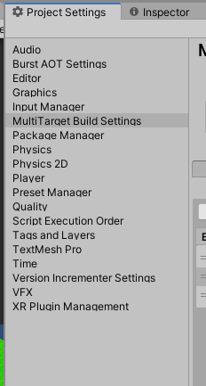
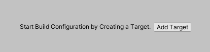
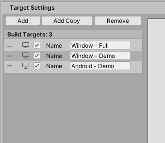
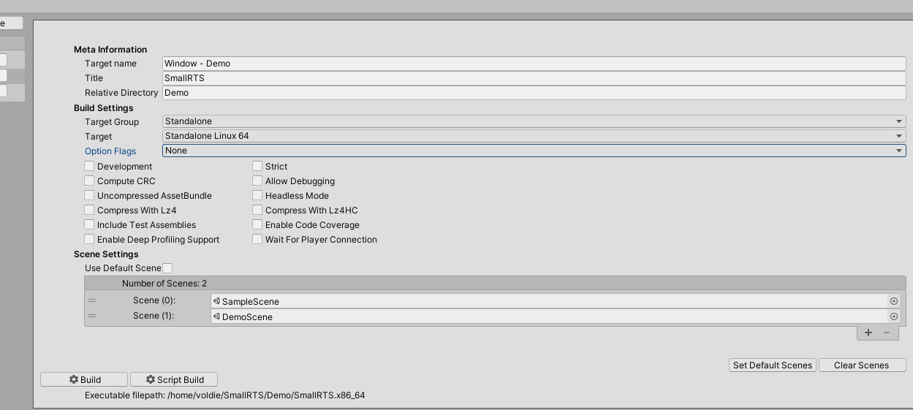
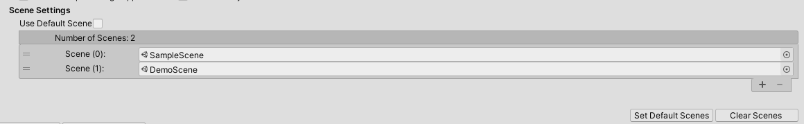
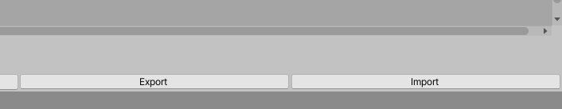

# Multiable Buildable Target Configuration Tool
[](https://openupm.com/packages/com.linuxsenpai.multitargetbuilder/)
[](https://www.gnu.org/licenses/gpl-3.0)
[](https://github.com/voldien/UMultiTargetBuilder/releases)


A Unity Provider setting tool that supports adding multiple build targets with different configurations for multiple platforms. All the targets can be built with a single button and written to their specified directories specified in their respective target settings. It allows for less time being spent on switching between build platforms. Furthermore, All the settings export and imported onto other projects easily.

# Features
- Multiple configurable build targets.
- Overridable Scene List for individual build targets.
- Run targets from the editor.
- Import/Export configuration settings.

Table of Contents
=================

- [Multiable Buildable Target Configuration Tool](#multiable-buildable-target-configuration-tool)
- [Features](#features)
- [Table of Contents](#table-of-contents)
- [Installation](#installation)
    - [Simple Download](#simple-download)
    - [Unity Package Manager (UPM)](#unity-package-manager-upm)
    - [OpenUPM](#openupm)
- [Quick Start](#quick-start)
  - [Open up the Configuration Window](#open-up-the-configuration-window)
  - [Fresh Configuration](#fresh-configuration)
  - [Additional Targets](#additional-targets)
  - [Configuration Target](#configuration-target)
  - [Override Scenes](#override-scenes)
  - [Run from Editor](#run-from-editor)
  - [Export/Import Settings](#exportimport-settings)
  - [Build](#build)
  - [Server/ Command Line Build Feature](#server-command-line-build-feature)
  - [Resources](#resources)
  - [Note](#note)
  - [Contributing](#contributing)
  - [Donations](#donations)
  - [License](#license)

# Installation

### Simple Download
[Latest Unity Packages](../../releases/latest)

### Unity Package Manager (UPM)

> You will need to have git installed and set in your system PATH.

Find `Packages/manifest.json` in your project and add the following:
```json
{
  "dependencies": {
    "com.linuxsenpai.multitargetbuilder": "https://github.com/voldien/UMultiTargetBuilder.git#0.1.6",
    "...": "..."
  }
}
```

### OpenUPM

Install the package with [OpenUPM](https://openupm.com/) through the commandline

```sh
# Install openupm-cli
$ npm install -g openupm-cli

# Enter your unity project folder
$ cd YOUR_UNITY_PROJECT_FOLDER

# Add package to your project
$ openupm add com.linuxsenpai.multitargetbuilder
```

# Quick Start

## Open up the Configuration Window
The configuration window can be found in the project settings window, under the *MultiTarget Build Settings* tab.



## Fresh Configuration
The first thing on a fresh configuration is to create a target.  After the first target, all the other configuration UI will be presented and visible for configuration.



## Additional Targets
Adding a target can be done as an empty new target or copy the currently selected target. The name is only used in the project and will not be the title. There is a dedicated field for setting the title for the target.



## Configuration Target
In the target configuration window. The meta-information, build settings, and scenes settings can be configured. 




## Override Scenes
On a selected *build target*, unchecking the Use default scene will enable the configuration list. From there adding and removing scenes can be performed.


## Run from Editor
Currently on the target with its platform that matches the host target platform can be run with success from the editor directly.

## Export/Import Settings
The settings can be export and import. Thus making it possible to use the settings across the project with the exception of the scene override that is dependent on the current project.



## Build
The tool support for building individual build target as well all the targets that are enabled. Furthermore, both support script only to build only the script.

## Server/ Command Line Build Feature
The target configurations can be build from using the command line. Where the build script [build.sh](build.sh) can be used. This allows for the game to be built in a headless Unity 3D or the original intent on a server for rapid builds.

However, note that this script is a UNIX shell script and thus only supports Unix based system Linux. See the following example. It requires a path to the unity program as the first argument. The second the path to the root directory of the project. Finally, the *-f* argument is the mode
```
build.sh /path/unity/Editor/Unity /path/project-directory -f
```
All the additional argument after the three-argument is required to be valid a *Unity 3D* command-line arguments. For instance, using the -quit argument is a valid appended command-line option.
```
build.sh /path/unity/Editor/Unity /path/project-directory -f -quit
```

## Resources

Quick Video of the main functionalities: [Video](https://www.youtube.com/watch?v=F8CBExsLApk)

A Comprehensive guide: *Still work in progress*.


## Note
It is designed to handle the common build target such as Windows, Linux, Android, iPhone and Mac OS-X. However, it has only been currently been manually tested for Windows, Linux, and Android. But, this should be work just fine since all the internal logic is handle by the Unity engine. 

## Contributing
If you have any idea, feel inclined to fork it and submit your changes back to me.


## Donations
The project was originally intended to be put on the Unity asset store. However, it was decided to make it free instead. If you find this tool useful consider making a donation.

[](https://www.paypal.com/cgi-bin/webscr?cmd=_s-xclick&hosted_button_id=R35V8EE62CBDL&source=url)

## License
This project is licensed under the GPL+3 License - see the [LICENSE](LICENSE) file for details
